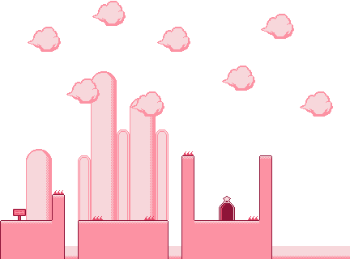

# Kirby-Like 2D Platformer Game

A modern 2D platformer game inspired by the classic Kirby series, built with TypeScript, Kaboom.js, and Vite.



## 🎮 Game Features

- **Classic Kirby Mechanics**: Inhale enemies and shoot them as projectiles
- **Multiple Enemy Types**: Flame enemies that jump, Guy enemies that patrol, and Bird enemies that fly
- **Two Unique Levels**: Each with distinct layouts and challenges
- **Smooth Physics**: Gravity, collision detection, and responsive platforming
- **Professional Graphics**: Pixel art sprites with smooth animations

## 🚀 Play the Game

### Online Demo
[🎮 Play Now](https://your-username.github.io/kirby-like-game) *(Coming Soon)*

### Local Development
```bash
# Clone the repository
git clone https://github.com/YOUR_USERNAME/kirby-like-game.git
cd kirby-like-game

# Install dependencies
npm install

# Start development server
npm run dev

# Open your browser to the provided localhost URL
```

## 🎯 Controls

- **Arrow Keys** or **WASD**: Move left/right
- **X** or **Space**: Jump (double jump available)
- **Z**: Inhale enemies / Shoot projectile (when full)

## 🛠️ Technology Stack

- **TypeScript**: Type-safe game development
- **Kaboom.js**: Lightweight 2D game engine
- **Vite**: Fast build tool and development server
- **Tiled**: Professional level editor for map creation

## 📁 Project Structure

```
src/
├── main.ts          # Game initialization and scene management
├── entities.ts      # Player and enemy definitions with behaviors
├── kaboomCtx.ts     # Kaboom.js engine configuration
├── utils.ts         # Map loading and utility functions
├── state.ts         # Global game state management
└── constants.ts     # Game configuration constants

public/
├── kirby-like.png   # Main sprite sheet
├── level-1.png      # Level backgrounds
├── level-2.png      
├── level-1.json     # Level data from Tiled editor
└── level-2.json     
```

## 🎨 Game Mechanics

### Player (Kirby)
- **Movement**: Smooth left/right movement with momentum
- **Jumping**: Double jump ability for platforming
- **Inhaling**: Suck in enemies when holding the inhale button
- **Shooting**: Transform inhaled enemies into projectile stars
- **Health System**: Take damage from enemies, respawn on death

### Enemy Types
- **Flame**: Stationary enemies that jump periodically
- **Guy**: Patrolling enemies that walk back and forth
- **Bird**: Flying enemies that spawn periodically and move across screen

### Level Design
- **Platform-based**: Traditional 2D platformer level layout
- **Collision System**: Precise collision detection for platforms and enemies
- **Spawn Points**: Data-driven enemy placement using Tiled editor
- **Camera System**: Smooth camera following with level boundaries

## 🔧 Development

### Building
```bash
npm run build
```

### Preview Production Build
```bash
npm run preview
```

### Adding New Levels
1. Create level layout in [Tiled Map Editor](https://www.mapeditor.org/)
2. Export as JSON to `public/` directory
3. Create background PNG image
4. Add level configuration in `main.ts`

### Adding New Enemy Types
1. Create sprite animations in the sprite sheet
2. Add animation definitions in `main.ts`
3. Create enemy factory function in `entities.ts`
4. Implement behavior using Kaboom.js state machines

## 📚 Learning Resources

Check out [`KIRBY_GAME_LEARNING_GUIDE.md`](./KIRBY_GAME_LEARNING_GUIDE.md) for:
- Detailed code explanation and architecture decisions
- Game development patterns and best practices
- TypeScript and modern web development techniques
- Performance optimization strategies
- Ideas for extending the game

## 🤝 Contributing

Contributions are welcome! Feel free to:
- Report bugs or suggest features
- Improve game mechanics or add new levels
- Enhance graphics or animations
- Optimize performance
- Add sound effects and music

## 📄 License

This project is open source and available under the [MIT License](LICENSE).

## 🙏 Acknowledgments

- Inspired by the classic Kirby games by Nintendo
- Built with [Kaboom.js](https://kaboomjs.com/) game engine
- Level design using [Tiled Map Editor](https://www.mapeditor.org/)
- Modern web development with [Vite](https://vitejs.dev/)

---

Made with ❤️ and TypeScript
